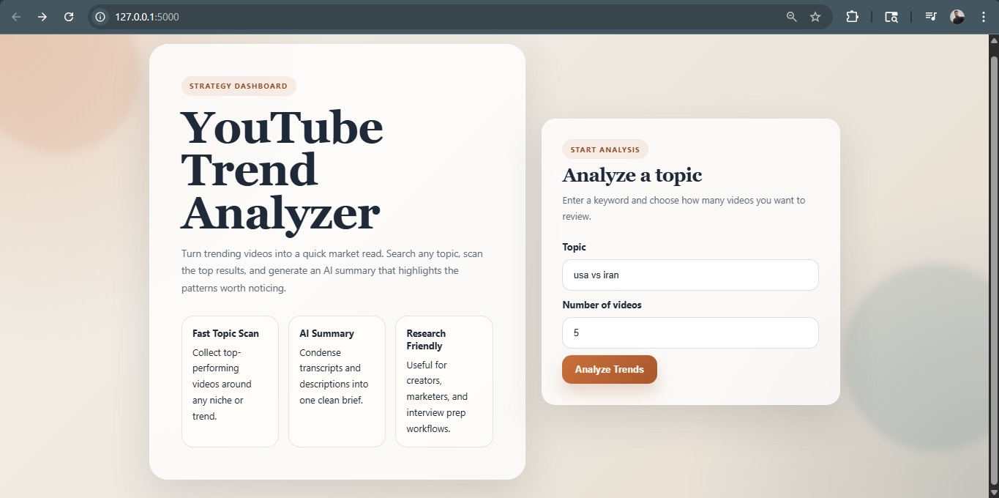
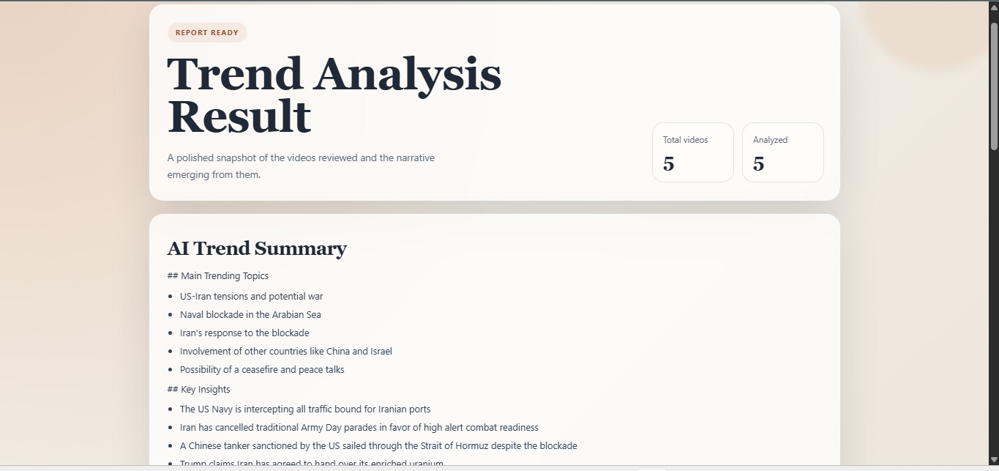
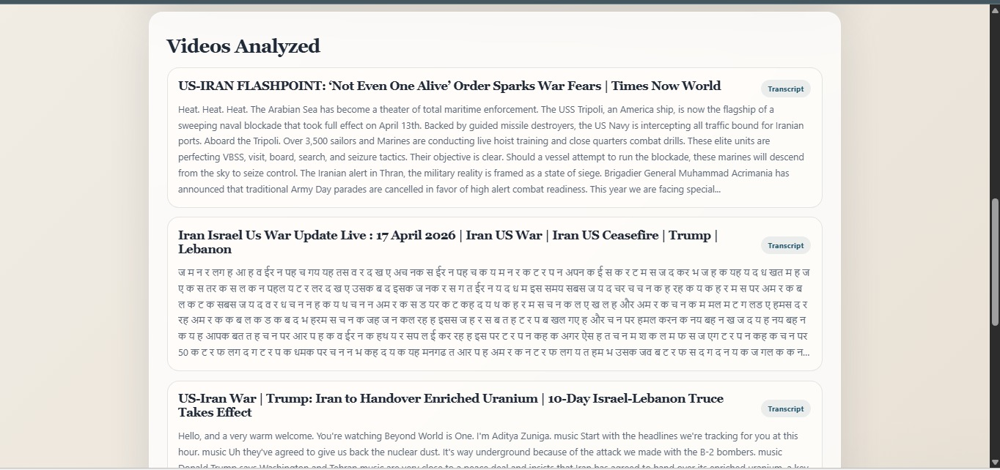

# YouTube Trend Analyzer

A Flask-based web app that analyzes YouTube trends by fetching videos for a topic, cleaning transcript or description data, and generating an AI-powered trend summary in a polished dashboard UI.

## Live Demo

[Live App](https://youtube-trend-analyzer-46er.onrender.com/)

Replace the localhost link later with your deployed URL.

## Features

- Search any topic and analyze up to 10 YouTube videos.
- Fetch transcript data when available and fall back to cleaned video descriptions.
- Generate an AI summary with clear sections for trends, insights, and patterns.
- View a cleaner results page with structured summaries and readable video previews.
- Responsive UI for desktop and mobile.

## Screenshots

Add your screenshots inside the root `screenshots` folder, then update filenames here if needed.

### Home Page



### Results Page1



### Results Page2




## Tech Stack

- Python
- Flask
- Groq API
- YouTube Data API
- YouTube Transcript API
- HTML
- CSS

## Project Structure

```text
youtube-trend-analyzer/
├── app.py
├── config.py
├── requirements.txt
├── screenshots/
├── services/
├── static/
└── templates/
```

## Setup

1. Create and activate a virtual environment.
2. Install dependencies:

```bash
pip install -r requirements.txt
```

3. Create a `.env` file in the project root:

```env
YOUTUBE_API_KEY=your_youtube_api_key
GROQ_API_KEY=your_groq_api_key
```

4. Run the app:

```bash
python app.py
```

5. Open:

```text
http://localhost:5000
```

## Notes

- If a transcript is unavailable, the app automatically uses a cleaned fallback based on the video description.
- The live link above is currently set to localhost as a placeholder.

## Built By

Built by Tushar
